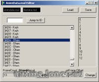

Program na nastavení statických animací.

Program sets static animations.

## Screenshot

## Downloads

- [Download](/files/manawydan/animdata.rar) (180 KB)

---

*Archived from the [Manawydan UO tools archive](https://web.archive.org/web/2015/http://ultima.manawydan.cz/) (originally by RadstaR, 2004-2016).*
