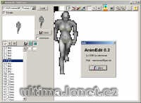

Program na úpravu (vycentrování) animací exportovaných z Mulpatcheru.

Program to center animations exported from mulpatcher.

## Screenshot

## Downloads

- [Download](https://files.uo.wzk.cz/manawydan/animedit0_2.rar) (1.5 MB)

---

*Archived from the [Manawydan UO tools archive](https://web.archive.org/web/2015/http://ultima.manawydan.cz/) (originally by RadstaR, 2004-2016).*
