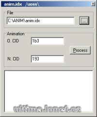

Program na změnu animací potvor.

Program change mobiles animation ID.

## Screenshot

## Downloads

- [Download](/files/manawydan/animpatcher.rar) (172 KB)
- [Delphi source code](/files/manawydan/animpatcher_source.rar) (7 KB)

---

*Archived from the [Manawydan UO tools archive](https://web.archive.org/web/2015/http://ultima.manawydan.cz/) (originally by RadstaR, 2004-2016).*
