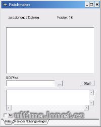

Program na tvorbu a aplikaci patchů.

Patch maker.

## Screenshot

## Downloads

- [Download](/files/manawydan/vd/autopatcher.rar) (727 KB)
- [Source Code](/files/manawydan/vd/autopatcher_source.rar) (2.8 MB)

---

*Archived from the [Manawydan UO tools archive](https://web.archive.org/web/2015/http://ultima.manawydan.cz/) (originally by RadstaR, 2004-2016).*
