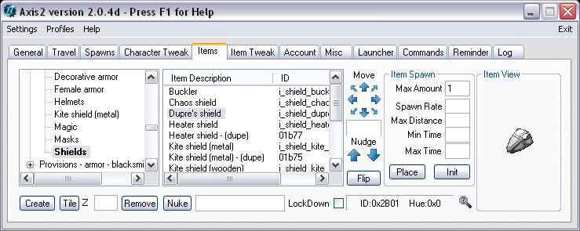

## Features

The long awaited successor of the famous AXIS GM Tool.  
Axis2 comes with a completely redesigned interface, is adapted to the new possibilities of recent Sphere versions, and tons of bugs from the “old Axis” fixed.

Please be aware that this Tool DOES NOT CONTAIN any tools for static- or other *.MUL-file patching. It’s a GM-Tool, NOT a patching tool, so it NEVER WILL!

UPDATE!!!  
Latest version includes support for ART and MAP in the .uop file format.

## Screenshots

## Downloads

  * [Axis2_Setup_2.0.4j.zip](</files/Axis2_Setup_2.0.4j.zip>)

## Others

  * [Official AxisII website](<https://forum.spherecommunity.net/sshare.php?srt=4&prj=1>)
