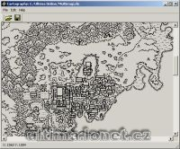

Program na import/export souboru z BMP do multimap.rle a obráceně.

Program export/import BMP to multimap.rle and backwards.

## Screenshot

## Downloads

- [Download](/files/manawydan/punt/cartography.rar) (1.97 MB)
- [C source code](/files/manawydan/punt/cartography_source.rar) (7 KB)

---

*Archived from the [Manawydan UO tools archive](http://ultima.manawydan.cz/) (originally by RadstaR, 2004-2016).*
