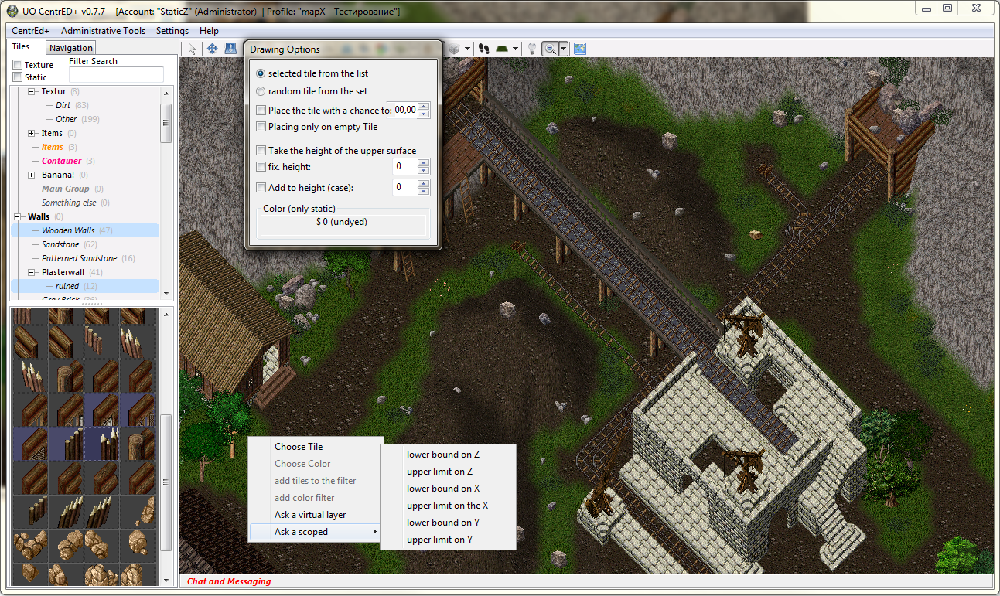
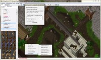

## Features

“CentrEd+” is the modified map and statics [CentrEd](<https://uo.wzk.cz/centred/>) editor of the last version 0.6.1 (by Andreas Schneider). Main advantages of “CentrEd+” are: better client data files support, group filtering for tiles, new tools, brushes, multi objects, runuo integration, updated and improved multi languageinterface, many other new features. The editor is the client-server application so it’s possible to edit and look through the maps for different people at the same time, besides the program allows to work with maps of any size. Originaly this modification was made espesially for the Quintessence server, but now after rather big work it’s able for all UO commnunity.

## Screenshots

## Downloads

  * [CentrED_Plus.zip](</files/CentrED_Plus.zip>)

## Manawydan Archive Downloads

> CZ: Program na vzdálenou úpravu souborů mapy.

  * [CentrED+ 0.7.7 (Manawydan)](/files/manawydan/centredplus77.7z) (2.78 MB)

## Others

  * To enable not official .mul tiles, download [VirtualTiles.xml](</files/VirtualTiles.zip>) and rewrite old one in CentrED+ **LocalData** folder.
  * ~~Official CentrED Plus website (dev.uoquint.ru)~~ — **Warning: the original CentrED+ website has been compromised and now uses browser fingerprinting to track visitors. Do not visit.**

## Modern Alternative: CentrED#

[CentrED#](https://kaczy93.github.io/centredsharp/) is a complete C# rewrite supporting Windows, Linux, and macOS (including Apple Silicon). It is actively maintained and recommended over CentrED+. See the [dedicated page](/centred-sharp/) on this archive.
