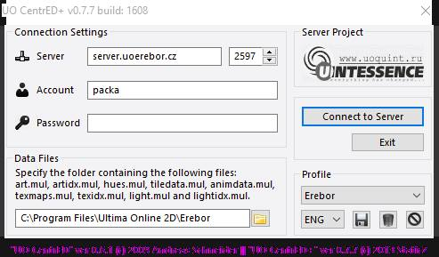

## Features

“CentrEd+” is the modified map and statics [CentrEd](<https://uo.wzk.cz/centred/>) editor of the last version 0.6.1 (by Andreas Schneider). Main advantages of “CentrEd+” are: better client data files support, group filtering for tiles, new tools, brushes, multi objects, runuo integration, updated and improved multi languageinterface, many other new features. The editor is the client-server application so it’s possible to edit and look through the maps for different people at the same time, besides the program allows to work with maps of any size. Originaly this modification was made espesially for the Quintessence server, but now after rather big work it’s able for all UO commnunity.

## Screenshots

## Downloads

  * [CentrED_Plus.zip](</files/CentrED_Plus.zip>)

## Manawydan Archive Downloads

> CZ: Program na vzdálenou úpravu souborů mapy.

  * [CentrED+ 0.7.7 (Manawydan)](/files/manawydan/centredplus77.7z) (2.78 MB)

## Installation & Configuration

1. Download CentrED+ (see downloads above)
2. Before first launch, enable custom tiles:
   - Go to the **LocalData** folder (e.g. `C:\Program Files (x86)\uoquint.ru\CentrED+\LocalData\`)
   - Download and replace [VirtualTiles.xml](/files/VirtualTiles.zip) to enable non-standard graphic items
3. Launch CentrED+ — enter your server host and port
4. Default port: **2597** (CentrED+ server), **2598** (CentrED classic server)

## Server Configuration

- [CentrED Map Configuration Reference (PDF)](/files/map_-_centred_-_aks_databasis_redmine.pdf) — map dimensions, file sizes, and format reference for CentrED server setup

## Collaborative Editing

CentrED+ supports multiple editors working on the same map simultaneously. Map changes happen on the CentrED server — not in your local game files. To avoid conflicts when multiple builders work on the same area, coordinate via your team's communication channel.

The server supports per-user region restrictions — administrators can grant or revoke edit access to specific map areas.

## Others

  * ~~Official CentrED Plus website (dev.uoquint.ru)~~ — **Warning: the original CentrED+ website has been compromised and now uses browser fingerprinting to track visitors. Do not visit.**

## Modern Alternative: CentrED#

[CentrED#](https://kaczy93.github.io/centredsharp/) is a complete C# rewrite supporting Windows, Linux, and macOS (including Apple Silicon). It is actively maintained and recommended over CentrED+. See the [dedicated page](/centred-sharp/) on this archive.
