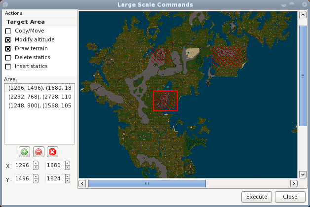
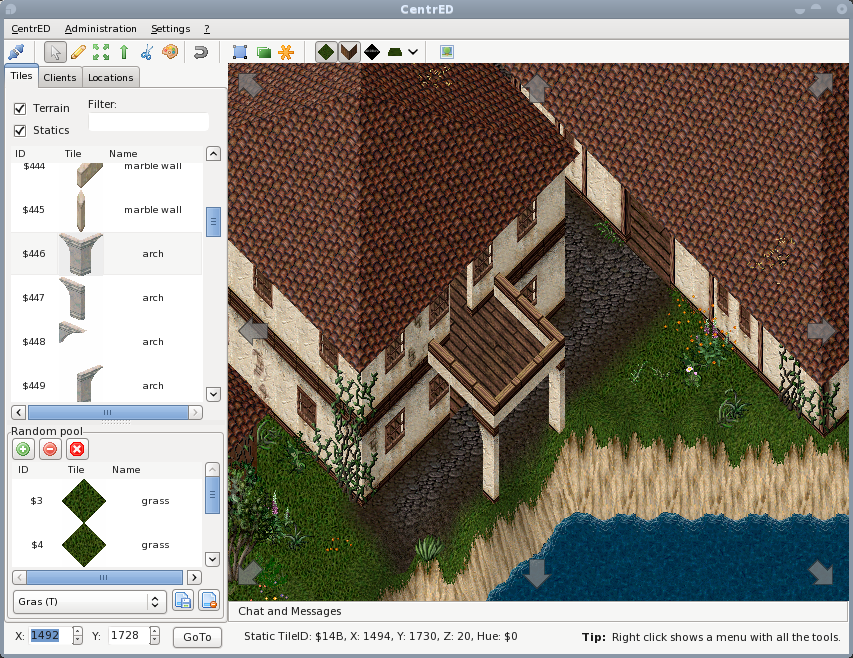
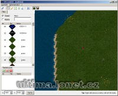

CentrED stands for Centralized Editing. It is a Client/Server based map editor for Ultima™ Online.  
The intention behind this is, that the only available GodClient is rather old and was never really supported by any server emulator (at least not that I know), but I wanted the ability for several people to work on the terrain and statics together, without having to constantly transfer their current state.

## Features

  * Complete serverside map. All blocks are transfered on request.
  * Modify Terrain
  * Add, delete, move and hue Statics
  * Change the altitude of Terrain and Statics
  * Account management with four accesslevels (None, Viewer, Normal and Administrator)
  * Restrict clients write access to specified regions (some sort of group management)
  * Integrated Chat
  * Client list with ability to jump to other clients position
  * Virtual Layer to ease working on roofs or in black areas
  * Large scale editing (move/copy, delete, draw, insert whole areas of the map)
  * Easily jump to locations stored in a list or via the radar view of the whole map
  * Ability to undo the last set of changes
  * Preview changes before actually performing them
  * Renders the map similar to the UO Client
  * Shows animated tiles
  * Show different light level and display light sources
  * Support as many different Statics as the TileData file can hold
  * Server and Client for 32bit Windows and Linux

## Screenshots

 

## Downloads

  * [CentrED_win_linux_server_client.zip](</files/CentrED_win_linux_server_client.zip>)
  * [CentrED_Manual.pdf](/files/CentrED_Manual.pdf)

## Manawydan Archive Downloads

> CZ: Program na vzdálenou úpravu souborů mapy.

  * [CentrED 0.6.3 (Manawydan)](/files/manawydan/centred063.rar) (1.2 MB)
  * [CentrED Changelog](/files/manawydan/centred_changelog.txt)

## Official v0.6.3 Downloads (from Redmine)

Available at [redmine.aksdb.de](https://redmine.aksdb.de/projects/centred/files) (may require login):

| File | Size | MD5 |
|------|------|-----|
| CentrED_win32_0-6-3.exe | 1.02 MB | `e16cd90500c3753cef7c24f252950783` |
| CentrED_linux_i386_gtk2_0-6-3.tbz | 1.75 MB | `f74d4f52bd5434fdd7cd168c8fa936df` |
| cedserver_win32_0-6-3.zip | 213 KB | `da1066b5aaa3ba4aac2b93c798fdeb67` |
| cedserver_linux_i386_0-6-3.tbz | 236 KB | `a8789f7e881cf61df0a46afc4b8ef476` |

## Server Setup

CentrED uses a client-server architecture. The server is a command-line application.

**Requirements:** i386 Windows or Linux (runs on 64-bit too), minimum 100MB RAM, an open TCP port.

**Configuration:** The server looks for a config file matching its name with `.ini` extension (typically `cedserver.ini`). On Windows, it auto-prompts on first run. On Linux, launch with `--init` parameter. Default port: 2597.

**Important:** Map files load with exclusive read/write permissions — no simultaneous access by other programs. RadarCol.mul and Tiledata.mul load as read-only.

## Map File Reference

| Map | Dimensions | File | Size |
|-----|-----------|------|------|
| Felucca (pre-ML) | 768x512 | map0.mul | 77 MB |
| Felucca (ML) | 896x512 | map0.mul | 89 MB |
| Trammel (ML) | 896x512 | map1.mul | 89 MB |
| Ilshenar | 288x200 | map2.mul | 11 MB |
| Malas | 320x256 | map3.mul | 16 MB |
| Tokuno | 181x181 | map4.mul | 6 MB |

Each map consists of three files: mapX.mul, staidxX.mul, staticsX.mul.

## NoDraw Tiles

CentrED can hide certain tiles via a `nodraw.txt` config file. Format:
- `T$2` — hide terrain tile 2
- `S$2198-$21A4` — hide static tiles in range 0x2198 to 0x21A4

Uses hexadecimal notation prefixed with `$`. The client loads from the application directory, user config directory, and MUL data directory.

## Modern Alternative: CentrED#

[CentrED#](https://kaczy93.github.io/centredsharp/) is a complete C# rewrite of CentrED by kaczy93. It supports Windows, Linux, and macOS (including Apple Silicon). Active development — see the [dedicated page](/centred-sharp/) on this archive.

## Others

  * [Official CentrED website](https://redmine.aksdb.de/projects/centred)
  * [Source code](https://redmine.aksdb.de/projects/centred/wiki/SourceCode) (Lazarus/FreePascal)
