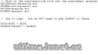

Dva programy na kopírování obsahu MUL souborů.

Program copy/insert data to MUL files.

## Screenshot

## Downloads

- [Download](/files/manawydan/copymuls.rar) (167 KB)

---

*Archived from the [Manawydan UO tools archive](http://ultima.manawydan.cz/) (originally by RadstaR, 2004-2016).*
