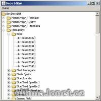

Program pro úpravu deco.xml. Program vyžaduje Java 5.0 a novější pro spuštění.

Program to edit file deco.xml. Need Java 5.0 or better to run.

## Screenshot

## Downloads

- [Download](/files/manawydan/arya/decoedit.rar) (1.25 MB)

---

*Archived from the [Manawydan UO tools archive](http://ultima.manawydan.cz/) (originally by RadstaR, 2004-2016).*
