## Features

Dragon allows a map maker to paint a map on a BMP image using PaintShop, PhotoShop, or other popular paint programs that support specific pallets, and render the image into a usable map with static files.

Dragon is very flexible and customizable as to editing the color pallet to your own land tiles or altitudes, as well as what world items it should place during the map rendering. (like trees, grass’s, and other worldly decorative items)

## Screenshots

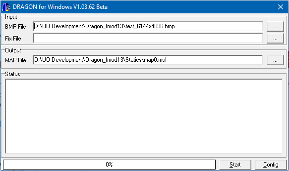

## Downloads

  * [dragonmod9.zip](</files/dragonmod9.zip>)
  * [dragonmod11.zip](</files/dragonmod11.zip>)
  * [Dragon_10362_Imod9+.zip](</files/Dragon_10362_Imod9.zip>)
    * This is the Updated Dragon 1.0362 with my Imod9+ add-on included. I figured I would offer it here for free to anyone looking to edit one of my existing IMod9+ maps that may be floating around out there. If you are looking to make your own map I recommend using my IMod13 add-on which I release free earlier in this forum. Enjoy!
  * [Dragon_10362_Imod13.zip](</files/Dragon_10362_Imod13.zip>)
    * This is a new addon for Dragon version 1.0362. It provides 9 new terrain types that were previously not available to developers
    * The main difference between the different version of Dragon Mod’s is new terrain types added as well as some of the scripts that generate coastlines etc… have been cleaned up so less touchup work is needed manually. There will still be some areas that will need manual touchups depending on how detailed you get with your BMP image. The more detail in the BMP (proper rounded corners and not choppy curves and corners) the less manual touchups will be needed to the generated map via an editor such as CentrED. To my knowledge my Dragon IMod13 offers the most terrain types and cleaned up scripts to date.
    * This new addon includes the following new terrain types.
    * 1) _Bayou or Dense Marsh:_ Dense cypress trees, some unpassable. 
      * 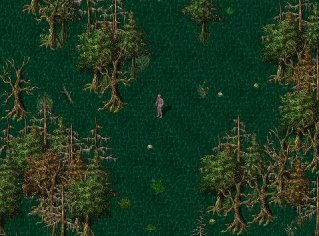
    * 2) _Clear Cut Forest:_ Used to show areas where lumber has been obtained. 
      * 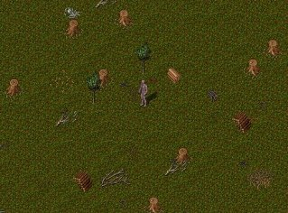
    * 3) _Desert Forest:_ Allows for dead/petrified forest in desert. 
      * 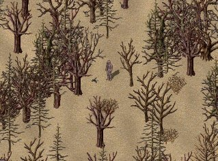
    * 4) _Glacier or Frozen tundra:_ Allows for flat open frozen tundra type areas. 
      * 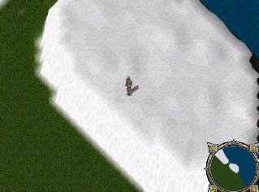
    * 5) _Prairie:_ Based off the US Mid-West type prairies. 
      * 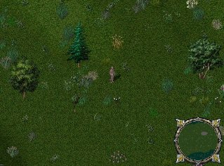
    * 6) _Savannah Desert:_ Desert with heavy vegetation, trees, and long grass throughout. 
      * 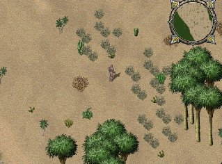
    * 7) _Snowy Forest:_ Allows typical forest areas to have snow and no follage on trees. 
      * 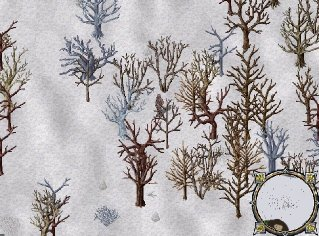
    * 8) _Snowy Meadow:_ Allows typical meadow areas to have snow and no follage on trees. 
      * 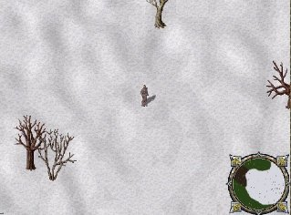
    * 9) _Wasteland:_ Area where everything is dead, forest fire/dragon attacked areas. 
      * 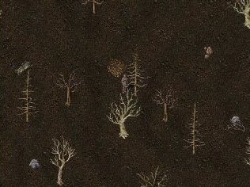
  * [UO-DragonMod11-MakingMapTutorial.pdf](<https://uo.wzk.cz/wp-content/uploads/sites/7/2017/07/UO-DragonMod11-MakingMapTutorial.pdf>)
  * [FAQ-Dragon-Problems.pdf](<https://uo.wzk.cz/wp-content/uploads/sites/7/2017/07/FAQ-Dragon-Problems.pdf>)

## Manawydan Archive Downloads

> CZ: Program na vygenerování mapy (MAPx.mul) z BMP obrázku.
>
> EN: Program generate map (MAPx.mul) from BMP picture.

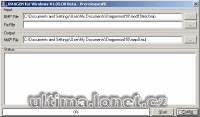

  * [Dragon Mod 9 (Manawydan)](/files/manawydan/dragon_mod9.rar) (901 KB)
  * [Dragon Mod 9 Plus](/files/manawydan/dragon_mod9plus.rar) (74 KB)
  * [Dragon Mod 10](/files/manawydan/dragon_mod10.rar) (1.12 MB)
  * [Dragon Mod 11](/files/manawydan/dragon_mod11.rar) (2.46 MB)

## Others

  * [Official DragonMod website](<http://www.playuo.org/emu/index.php?threads/dragon-map-maker.96/>)

---

## Historical Comments

> **Muddled** (2018-03-23):
>
> I noticed none of the copies you posted here have SCP files for adding the statics (Trees and such) into the world with the static program. Do you happen to have a set? or am I missing something?
> 
> Thanks.

