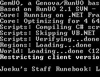

Ultima Online Emulator with SA support.

## Screenshot

## Downloads

- [Download](/files/manawydan/runuo/gemuo_14_04_2010.rar) (2.78 MB)

---

*Archived from the [Manawydan UO tools archive](http://ultima.manawydan.cz/) (originally by RadstaR, 2004-2016).*
