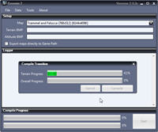

Program na převod mapy do UO formátu.

UO Map Compiler Utility for compiling your maps.

## Screenshot

## Downloads

- [Download](https://files.uo.wzk.cz/manawydan/ravenal/genesis252f.rar) (6.27 MB)
- [Changelog](https://files.uo.wzk.cz/manawydan/ravenal/genesis_changelog.txt)

## Links

- Homepage: mygametools.com (offline)

---

*Archived from the [Manawydan UO tools archive](https://web.archive.org/web/2015/http://ultima.manawydan.cz/) (originally by RadstaR, 2004-2016).*
