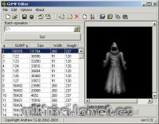

Program na přidávání nových gumpů do verdata.mul.

Program add gumps to verdata.mul.

## Screenshot

## Downloads

- [Download](/files/manawydan/gumpeditor031beta.rar) (266 KB)

---

*Archived from the [Manawydan UO tools archive](http://ultima.manawydan.cz/) (originally by RadstaR, 2004-2016).*
