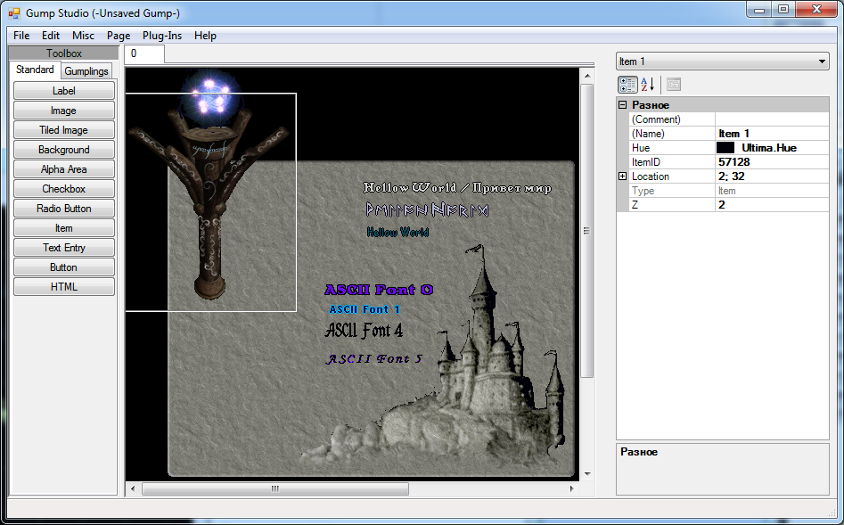

## Features

This program allows you to build gump and then save them as file or scripts for use in your server (Sphere, RunUO, …)

## Screenshots

## Downloads

  * [GumpStudio_1_8_R3.zip](</files/GumpStudio_1_8_R3.zip>)
  * [GumpStudio_1_8_R3_quinted-02](</files/GumpStudio_1_8_R3_quinted-02.zip>) – 1.8q.02 
    * There is very usefull tool called “Gump Studio” maded by Bradley Uffner. But it has little problem that is critical for me – it crashed if you try to use сyrillic alphabet. That was there reason why this moddification appears. As it appeared Author was greedy for chars cache and limit it little more then 1000 chars, that cause exception as сyrillic alphabet in unicode use codes 1025 and 1040-1105, so after I encrease cach size to 1120 the problem was solved. (If someone will need use chars above 1120 – write, it’s easy to encrease it more). Also i made this changes: 
      * Add property “Partial Hue” for Labels, as client in most cases use this behaviour.
      * Add property “Unicode” for labels, that switch using fonts between ASCII and Unicode.
      * Add all UO fonts (13 unicode and 10 ASCII, originaly there where only 3 fonts).
      * Add HS support, so it’s possible to use items ID with indexex up to 0x10000.
      * Increased working area from 800×600 up to 1600×1200\. This allows to designe large gumps.
      * Fixed bug with changing client path (by default GumpStudio first checked registery, so if you have installed client it becomes impossible to load mul files from custom path)

## Others

  * [Official GumpStudio quinted version](<https://www.servuo.com/archive/gump-studio-moddification.214/>)

---

## Historical Comments

> **Artax** (2019-04-13):
>
> Hello, I have a problem with inserting a textentry, telling me that the library is not there but I have everything updated, can you solve this problem? if you want I can make you an error screen.
> 
> Thanks Artax

