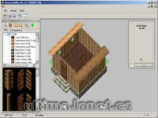

Program na úpravu a tvorbu staveb.

Program to building and editing houses etc.

## Screenshot

## Downloads

- [Download](/files/manawydan/house_builder13c.rar) (230 KB)
- [C# source code](/files/manawydan/house_builder13c_source.rar) (162 KB)

---

*Archived from the [Manawydan UO tools archive](https://web.archive.org/web/2015/http://ultima.manawydan.cz/) (originally by RadstaR, 2004-2016).*
