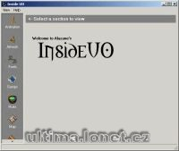

Program na prohlížení různých věcí v souborech (Animace, grafika itemů, fonty, gumpy, barvy, mapa apod.).

UO mul files viewer.

## Screenshot

## Downloads

- [Download](/files/manawydan/insideuo.rar) (313 KB)
- [Delphi 5 source code](/files/manawydan/insideuo_source.rar) (226 KB)

---

*Archived from the [Manawydan UO tools archive](https://web.archive.org/web/2015/http://ultima.manawydan.cz/) (originally by RadstaR, 2004-2016).*
