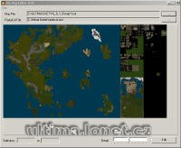

Sada programů. Určeno hlavně pro Iris klienta.

Iris client programs.

## Screenshot

## Downloads

- [Download](/files/manawydan/iris_framework0_4.rar) (10 MB)

## Links

- [Homepage](http://www.iris2.de/)

---

*Archived from the [Manawydan UO tools archive](http://ultima.manawydan.cz/) (originally by RadstaR, 2004-2016).*
