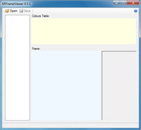

Program na prohlížení animací z UOKR.

This is simple program to see Frames of unpacked animationframeX.uop, paperdoll.uop.

## Screenshot

## Downloads

- [Download 0.6.1](/files/manawydan/kons/frameviewer061.rar) (12 KB)
- [Download 0.5.1](/files/manawydan/kons/frameviewer051.rar) (58 KB)

---

*Archived from the [Manawydan UO tools archive](http://ultima.manawydan.cz/) (originally by RadstaR, 2004-2016).*
