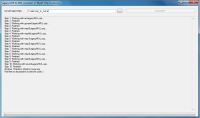

Converter from legacy UOPs to MULs.

## Screenshot

## Downloads

- [Download](/files/manawydan/uokr/legacyuop_to_mul.rar) (77 KB)

---

*Archived from the [Manawydan UO tools archive](http://ultima.manawydan.cz/) (originally by RadstaR, 2004-2016).*
