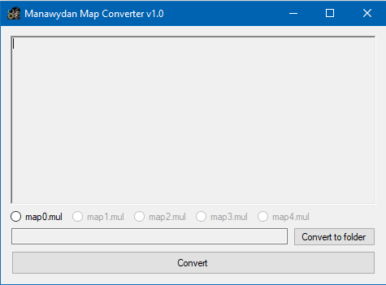
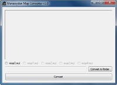

## Features

Convert map from 2d client to UOKR (C# source code included).

## Screenshots

 

## Downloads

  * [ManawydanMapConverter.zip](</files/ManawydanMapConverter.zip>)

## Manawydan Archive Downloads

> CZ: Převede mapu z 2D klienta do formátu UOKR.
>
> EN: Convert map from 2D client to UOKR.

  * [Download + C# source code (Manawydan)](/files/manawydan/uokr/mwmapconverter.rar) (43 KB)
