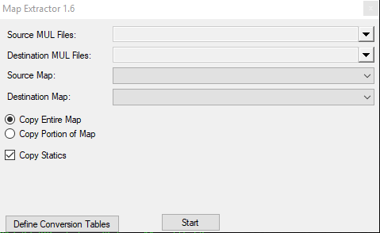

## Features

I know there are several applications out there to extract maps or sections of maps and copy the contents to other maps. Unfortunately though, I have not been able to get any of those applications to function properly. Perhaps that is because I am using Windows 7, or maybe they just don’t work with the new file sizes. Either way, I decided to go about creating a utility for my own use.

I use Dragon Mod9 to create my maps. While it does a good job for what it is, it doesn’t allow creation of maps other than map0 in the old size. This application can allow you to use Dragon, of another mapping program, and then splice maps together to form a product that you can start editing with Worldbuilder, CentrED or the like.

To start, simply specify the path where your map and static muls are located and the destination path to copy to. This can be the same path as long as you are working with different maps. If you are simply resizing an existing map, it would be best to specify a different folder for the destination.

Next, specify the source and destination maps. For example, if you want to enlarge a 6144×4096 Felucca map, select Map0 6144×4096 as your source map and Map0 7168×4096 as your destination. If you draw a new Tokuno map within a map0 created by Dragon, then select Map0 6144×4096 as the source and Map4 as the destination.

By default, the application will clone the source map and make a straight copy. If you are copying a larger map to a smaller area, the application will start at coordinates 0,0 and stop at the destination map size. If you are enlarging a map, the application will fill the additional space with black space.

You can specify to copy statics to the new map and you can set the application to copy a specific portion of the source map to a specific location of the destination map. This will allow you to utilize that extra space in the 7168×4096 maps.

I think that pretty well sums it up. Hopefully some others can make use of this application. There are other applications that do similar functions, but this is a fast alternative if you are having difficulty performing these map making tasks. Let me know if you run into any problems and I will get them corrected as soon as possible.

**Changes in Version 1.5:**  
Added ability to convert IDs of statics.

**Changes in Version 1.6:**  
Corrected sizing issues when creating map2.mul replacements.

Dougan Ironfist

## Screenshots

 

## Downloads

  * [Map Extractor 1.6.zip](</files/Map-Extractor-1.6.zip>)

## Others

  * [Official Map Extractor website](<http://www.runuo.com/community/threads/map-extractor.468585/>)
  * [Source code](</files/sourcecode-dougan-ironfist-runuo-scripts-n-tools.zip>)
