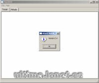

Program na převod mapy do BMP určené pro UO Landscaper.

Program convert mapx.mul to BMP files for UO Landscaper.

## Screenshot

## Downloads

- [Download](https://files.uo.wzk.cz/manawydan/mul2bmp.rar) (1.97 MB)
- [Perfect BMP XML](https://files.uo.wzk.cz/manawydan/mul2bmp_perfect_bmp.rar) (4 KB)

---

*Archived from the [Manawydan UO tools archive](https://web.archive.org/web/2015/http://ultima.manawydan.cz/) (originally by RadstaR, 2004-2016).*
