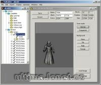

Program na přidávání itemů, gumpů a animací do verdat.

Program to editing/adding items to verdata.mul.

## Screenshot

## Downloads

- [Download](/files/manawydan/mulbuilderbeta2.rar) (548 KB)

---

*Archived from the [Manawydan UO tools archive](http://ultima.manawydan.cz/) (originally by RadstaR, 2004-2016).*
