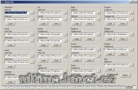

Program na přidávání různých věcí do verdat nebo mul souborů.

Program to editing/adding/deleting items from MUL and verdata.mul files.

## Screenshot

## Downloads

- [Download](/files/manawydan/vd/mulpatcher.rar) (497 KB)
- [Changelog](/files/manawydan/vd/mulpatcher_changelog.txt)
- [Source Code](/files/manawydan/vd/mulpatcher_source.rar) (1.99 MB)

---

*Archived from the [Manawydan UO tools archive](http://ultima.manawydan.cz/) (originally by RadstaR, 2004-2016).*
