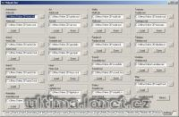

Program na přidávání různých věcí do verdat nebo mul souborů.

Program to editing/adding/deleting items from MUL and verdata.mul files.

## Screenshot

## Downloads

- [Download](https://files.uo.wzk.cz/manawydan/vd/mulpatcher.rar) (497 KB)
- [Všeobecný pokec o MulPatchi](https://files.uo.wzk.cz/manawydan/Vseob_pokec_o_Mulpatch.pdf) — guide to MulPatcher (PDF, Slovak)
- [Changelog](https://files.uo.wzk.cz/manawydan/vd/mulpatcher_changelog.txt)
- [Source Code](https://files.uo.wzk.cz/manawydan/vd/mulpatcher_source.rar) (1.99 MB)

---

*Archived from the [Manawydan UO tools archive](https://web.archive.org/web/2015/http://ultima.manawydan.cz/) (originally by RadstaR, 2004-2016).*
