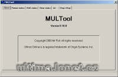

Program na kopírování statiky, úprava mapy.

Program edit and copy statics and map files.

## Screenshot

## Downloads

- [Download](https://files.uo.wzk.cz/manawydan/multool.rar) (32 KB)

---

*Archived from the [Manawydan UO tools archive](https://web.archive.org/web/2015/http://ultima.manawydan.cz/) (originally by RadstaR, 2004-2016).*
