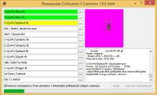

Program pro převod animací z Civilization 3 (FLC) do Ultimy (Export pro Mulpatcher).

Convert Civilization 3 animations (FLC) to Ultima Online (Mulpatcher compatible).

## Screenshot

## Downloads

- [Download](/files/manawydan/radstar/mw_civilization_convertor130.7z) (9.36 MB)
- [Download x64](/files/manawydan/radstar/mw_civilization_convertor130x64.7z) (10.28 MB)

---

*Archived from the [Manawydan UO tools archive](http://ultima.manawydan.cz/) (originally by RadstaR, 2004-2016).*
