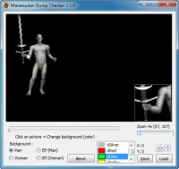

Program na kontrolu umístění a průhlednosti obrázku (itemy v gumpech).

Program checking gump coordinates and transparency (items gump).

## Screenshot

## Downloads

- [Download](/files/manawydan/radstar/mw_gump_checker150.rar) (509 KB)

---

*Archived from the [Manawydan UO tools archive](http://ultima.manawydan.cz/) (originally by RadstaR, 2004-2016).*
