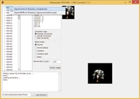

Převádí animace z Enhanced klienta na BMP obrázky.

Convert animations from Enhanced client to BMP pictures.

## Screenshot

**Usage:**
1. Extract animations with *Mythic Package Editor*
2. Load directory structure from *animationframe* directory
3. Select animation type
4. Right click on animation number and select Export anim

## Downloads

- [Download](/files/manawydan/radstar/mw_bin_convertor111.7z) (503 KB)

---

*Archived from the [Manawydan UO tools archive](http://ultima.manawydan.cz/) (originally by RadstaR, 2004-2016).*
