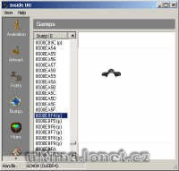

Opravuje efekt 'svatozáře' kolem několika itemů v paperdollu. Instalátor aplikuje opravenou grafiku přímo do souboru verdata.mul. Zdrojový soubor je určený pro Mulbuilder.

## Screenshot

## Downloads

- [Instalátor](/files/manawydan/radstar/opravena_grafika.exe) (167 KB)
- [Zdroják](/files/manawydan/radstar/opravena_grafika.rar) (88 KB)

---

*Archived from the [Manawydan UO tools archive](http://ultima.manawydan.cz/) (originally by RadstaR, 2004-2016).*
