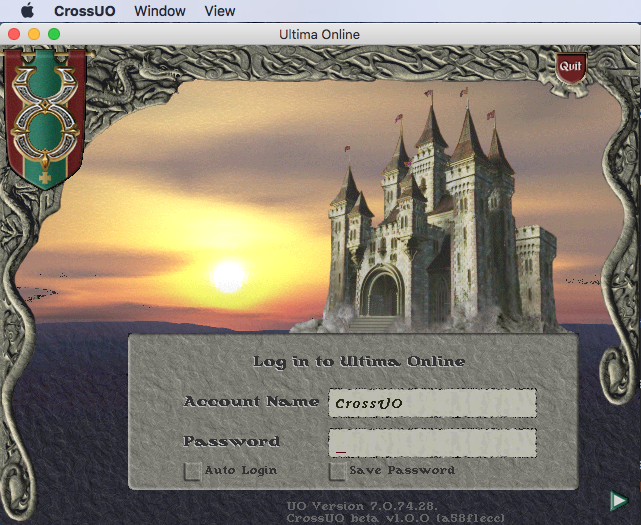

OrionUO is an open-source alternative Ultima Online client written in C++. It provides improved rendering performance, modern resolution support, and additional features not available in the official EA client. OrionUO includes its own configuration editor and the Orion Assistant (OA) for macro and automation functionality. The client supports both classic MUL files and modern UOP format. This archive contains the full source code and precompiled binaries including dependencies (FreeImage, GLEW, BASS audio).

## Screenshot

## Download

- [OrionUO (Source + Binaries)](https://pub-79b5028945c441d990e0babe712bcbb6.r2.dev/toolbox/OrionUO-master.zip) (27 MB)

---
*Archived from the [UO FreeShard Community Tool Box](https://archive.org/details/UOFreeShardCommunityToolBoxLastUpdate03.31.2019) (archive.org, 2019).*
