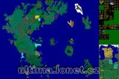

Povrchy map (bez výšek) pro vygenerování v UO Landscaperu 1.1.

## Screenshot

## Downloads

- [Download](/files/manawydan/orbsydia/uo_maps_uol11.rar) (1 MB)

---

*Archived from the [Manawydan UO tools archive](http://ultima.manawydan.cz/) (originally by RadstaR, 2004-2016).*
