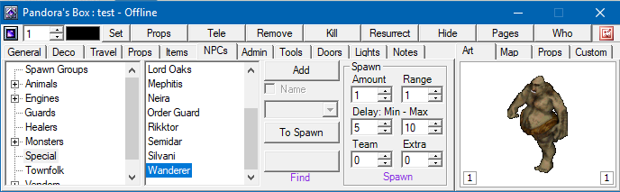

## Features

Pandora’s Box it’s an Ultima Online utility for building and administrate shards created by Arya. Pandora’s Box 3 will have support for the new Ultima Online expansion, Mondain’s Legacy, and will be compiled with 3.5 Net Framework. We also try to improve the code to have better stability and performance.

## Screenshots

 

 

## Downloads

  * [PandorasBox3.0.0.5.zip](</files/PandorasBox3.0.0.5.zip>)

## Manawydan Archive Downloads

> CZ: Program pro GM na snadnější ovládání UO.

  * [Pandora’s Box 2.0.0.5 (Manawydan)](/files/manawydan/arya/pandorasbox2005.html) (1 MB)
  * [Pandora’s Box 2.0.0.5 C# Source code](/files/manawydan/arya/pandorasbox2005source.rar) (1.84 MB)
  * [Pandora’s Box 2.0.0.5 RunUO 2 update](/files/manawydan/arya/pandorasbox2005_runuo2.rar) (460 KB)
  * [Pandora’s Box 2.0.0.7 update](/files/manawydan/arya/pandorasbox2007.rar) (353 KB)
  * [Pandora’s Box 3.0.0.2](/files/manawydan/arya/pandorasbox3002.rar) (670 KB)

## Others

  * [Official Pandora’s Box website](<https://code.google.com/archive/p/pandorasbox3/>)
  * [PandorasBox3.0.0.5_source_code.zip](</files/PandorasBox3.0.0.5_source_code.zip>)
  * [PandorasBox-MLItemsDll.zip](</files/PandorasBox-MLItemsDll.zip>)
