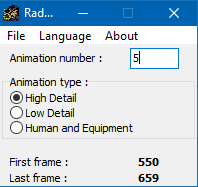
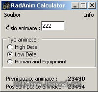

## Features

Program calculates first and last animation frame number.

## Screenshots

 

## Downloads

  * [RadAnimCalculator.zip](</files/RadAnimCalculator.zip>)

## Manawydan Archive Downloads

> CZ: Program na spočítání první a poslední pozice animace.

  * [RadAnim Calculator 1.0.1 (Manawydan)](/files/manawydan/radstar/radanimcalculator1.0.1.exe) (263 KB)
