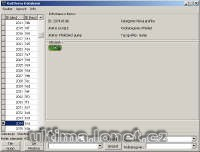

Program slouží pouze k uložení obrázků do databáze, nelze s ním patchovat ani jinak upravovat soubory Ultimy Online. Použít ho lze jako offline prohlížeč nové grafiky.

This program can only save images to database, cannot patch any Ultima Online files. You can use it as offline images viewer.

## Screenshot

## Downloads

- [Download](/files/manawydan/radstar/raditemsdatabase1.1.0.exe) (728 KB)
- [Changelog (CZ)](/files/manawydan/radstar/raditems_changelog.txt)
- [Changelog (EN)](/files/manawydan/radstar/raditems_changelog_eng.txt)

---

*Archived from the [Manawydan UO tools archive](http://ultima.manawydan.cz/) (originally by RadstaR, 2004-2016).*
