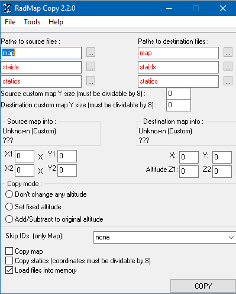
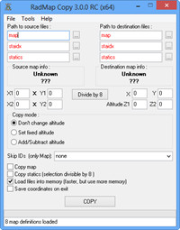

## Features

Program to copy map region from one map to other.

## Screenshots

 

 

## Downloads

  * [radmapcopy2_2_0.zip](<https://files.uo.wzk.cz/radmapcopy2_2_0.zip>)

## Manawydan Archive Downloads

> CZ: Program na kopírování jedné části mapy do druhé.
>
> EN: Program to copy map region from one map to other.

  * [RadMap Copy 3.0.1 (Manawydan)](https://files.uo.wzk.cz/manawydan/radstar/radmapcopy301.rar) (1.1 MB)
  * [RadMap Copy 2.2.0](https://files.uo.wzk.cz/manawydan/radstar/radmapcopy2_2_0.rar) (248 KB)
  * [Changelog (CZ)](https://files.uo.wzk.cz/manawydan/radstar/radmapcopy_changelog.txt)
  * [Changelog (EN)](https://files.uo.wzk.cz/manawydan/radstar/radmapcopy_changelog_eng.txt)
  * [2.1.0 Delphi 2006/2007 source](https://files.uo.wzk.cz/manawydan/radstar/radmapcopy_source.rar) (18 KB)
