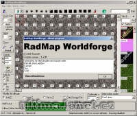

Program na úpravu souborů map0.mul až map5.mul.

Program to edit files from map0.mul to map5.mul.

## Screenshot

## Downloads

- [Download 1.4.1](/files/manawydan/radstar/radmap_worldforge141.rar) (1.2 MB)
- [Download 1.3.1](/files/manawydan/radstar/radmap_worldforge1_3_1.rar) (401 KB)
- [Changelog (CZ)](/files/manawydan/radstar/radmap_worldforge_changelog_czech.txt)
- [Changelog (EN)](/files/manawydan/radstar/radmap_worldforge_changelog.txt)
- [1.2.6 Delphi source](/files/manawydan/radstar/radmapworldforge_source.rar) (186 KB)

---

*Archived from the [Manawydan UO tools archive](http://ultima.manawydan.cz/) (originally by RadstaR, 2004-2016).*
