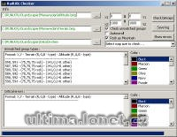

Program hledá chyby v obrázcích pro UO Landscaper.

Program searching errors in pictures for UO Landscaper.

## Screenshot

## Downloads

- [Download](/files/manawydan/radstar/raduol_checker1_2_0.rar) (234 KB)
- [Changelog (CZ)](/files/manawydan/radstar/raduol_changelog_czech.txt)
- [Changelog (EN)](/files/manawydan/radstar/raduol_changelog.txt)
- [Delphi 2006 source](/files/manawydan/radstar/raduolchecker_source.rar) (115 KB)

---

*Archived from the [Manawydan UO tools archive](http://ultima.manawydan.cz/) (originally by RadstaR, 2004-2016).*
