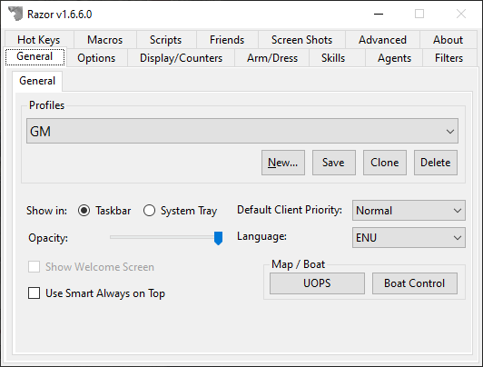

Razor is the most widely used assistant program for Ultima Online. It provides essential quality-of-life features including macro recording and playback, hotkeys, auto-healing, dress/undress agents, organizer agents, vendor buy/sell agents, counter bars, and overhead messages. Razor works by injecting into the UO client process and intercepting network packets. Nearly every freeshard player uses Razor or one of its derivatives. This archive contains the classic Razor build with full functionality.

## Screenshot

## Download

- [Razor](/files/toolbox/Razor.zip) (5.2 MB)

---
*Archived from the [UO FreeShard Community Tool Box](https://archive.org/details/UOFreeShardCommunityToolBoxLastUpdate03.31.2019) (archive.org, 2019).*
