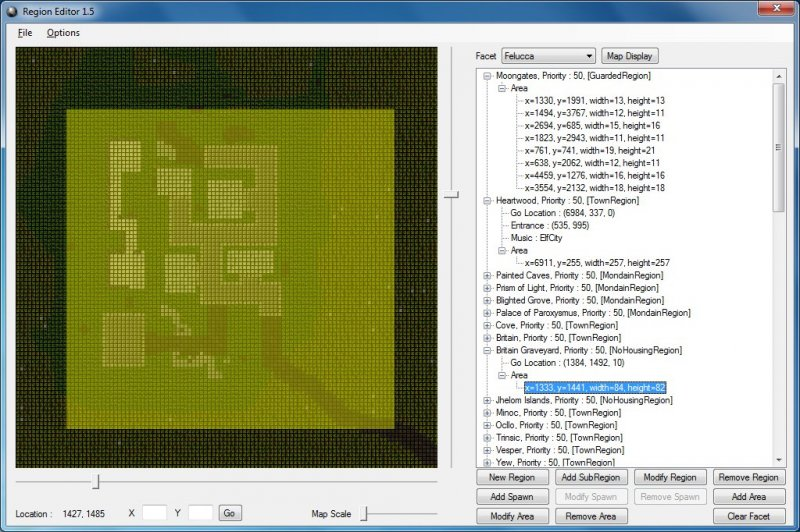
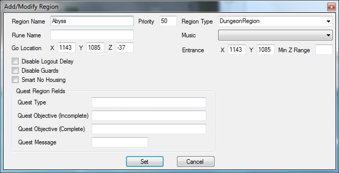
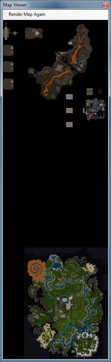
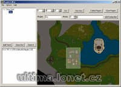

## Features

While working on implementing custom maps, I found that region editors online were obsolete and non-functional. Since I have quite a bit of region work to do, I decided to design a new region editor for RunUO. This project was just completed today and even though I have tested every feature, there may be scenarios I just didn’t plan for. If you run into any bugs, please let me know and I will correct them.

Setting up this application is rather easy. Just launch the program and specify the location of your mul files and the regions.xml file on your system.

The region map is initially displayed in a full sized grid. There is a slider to adjust the scaling of the map. Just keep in mind that as you decrease the scale of the map, the time to render each chunk takes a bit longer.

Areas can be selected on the map in two ways. For small areas, simply click and drag to highlight a section of the map on screen. For larger areas that cannot appear on screen all at once, you can simply left click on one corner of the area and then shift-click on the other corner and the whole area will highlight.

On the right, you have the Facet combobox and the list of defined regions for the selected facet. When you change facets, the map and region list is updated on the window. The bottom buttons allow you to add, modify and delete regions, sub-regions, region spawns and rectangular areas that make up the region.

At the top of the window is a Map Display button. This button will render the entire map of the selected facet into a new window. This process can be lengthy. However, the rendered image is saved to file for future use. The Map Display button will use the rendered image from that point on unless you specifically instruct the image to render again. You can double click anywhere on the large map and the small map on the main window will move to that location.

If you make a mistake with region editing, you can click the File menu and instruct the application to reload the regions from file.

Hopefully this application will help everyone that needs to work on their region files for custom worlds. Please let me know if you run into any problems with this application.

## Screenshots

  

 

## Downloads

  * Region Editor for RunUO SVN 663 –****[Region Editor 1.7.zip](</files/Region-Editor-1.7.zip>)

## Manawydan Archive Downloads

> CZ: Program pro generování XML souboru s regiony pro RunUO.

  * [Region Editor (Manawydan)](/files/manawydan/arya/regioneditor.rar) (203 KB)
  * [Region Editor C# Source](/files/manawydan/arya/regioneditorsource.rar) (55 KB)
  * [Region Editor 2 C# Source](/files/manawydan/arya/regioneditor2source.rar) (55 KB)
  * [Region Editor for RunUO 2](/files/manawydan/arya/regioneditorrunuo2.rar) (311 KB)
  * [Region Editor RunUO 2 C# Source](/files/manawydan/arya/regioneditorrunuo2source.rar) (72 KB)

## Others

  * [Official Region Editor website](<http://www.runuo.com/community/threads/region-editor-for-runuo-svn-663.468210/>)
  * [Source code](</files/sourcecode-dougan-ironfist-runuo-scripts-n-tools.zip>)

---

## Historical Comments

> **memoley** (2020-08-13):
>
> does it not work anymore brother? im having an issue after chosing shardname after the id/pw login… is stuck on connecting…

> **Soner (Turkey)** (2024-02-14):
>
> Are you still following the game? If it’s not too difficult for you, could you slice up the cities and dungeons of Ultima Online into pieces? For example, Britania.mul, Yew.mul, Trinsic.mul, and the others..

