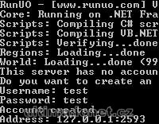

Ultima Online Emulator.

## Screenshot

## Downloads

- [1.0.0 Final](/files/manawydan/runuo/runuo_1_0_0.rar) (5.2 MB)
- [1.0.0 Source Code](/files/manawydan/runuo/runuo_1_0_0_source.rar) (200 KB)
- [2.0 SVN 526 ML SA 1.5](/files/manawydan/runuo/runuo2sa15.7z) (2.36 MB)
- [2.2](/files/manawydan/runuo/runuo_2_2.rar) (3.57 MB)
- [2.2 C# Source code](/files/manawydan/runuo/runuo_2_2_source.rar) (170 KB)
- [2.3 SVN 1082](/files/manawydan/runuo/runuo23_svn1082.7z) (4.35 MB)
- [2.6](/files/manawydan/runuo/runuo_2_6.7z) (4.92 MB)

---

*Archived from the [Manawydan UO tools archive](http://ultima.manawydan.cz/) (originally by RadstaR, 2004-2016).*
