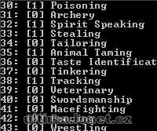

Program na úpravu seznamu a názvů skillů.

Program edit skills files.

## Screenshot

## Downloads

- [Download](/files/manawydan/skilltools.rar) (45 KB)

---

*Archived from the [Manawydan UO tools archive](http://ultima.manawydan.cz/) (originally by RadstaR, 2004-2016).*
