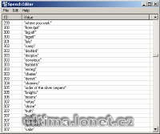

Program na úpravu souboru speech.mul.

Program edit file speech.mul.

## Screenshot

## Downloads

- [Download](https://files.uo.wzk.cz/manawydan/speecheditor.rar) (65 KB)

---

*Archived from the [Manawydan UO tools archive](https://web.archive.org/web/2015/http://ultima.manawydan.cz/) (originally by RadstaR, 2004-2016).*
