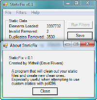

Program na opravu statics souborů.

StaticFix will read in your static files, allow you to remove invalid and duplicate statics and then write out new static files.

## Screenshot

## Downloads

- [Download](/files/manawydan/staticfix01.rar) (12 KB)

---

*Archived from the [Manawydan UO tools archive](http://ultima.manawydan.cz/) (originally by RadstaR, 2004-2016).*
