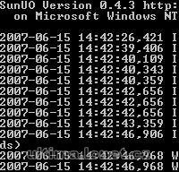

Ultima Online Emulator.

## Screenshot

## Downloads

- [Download 0.5.1](https://files.uo.wzk.cz/manawydan/runuo/sunuo0_5_1.rar) (3.3 MB)
- [C# Source Code](https://files.uo.wzk.cz/manawydan/runuo/sunuo0_5_1_source.rar) (1.57 MB)
- [Changelog](https://files.uo.wzk.cz/manawydan/runuo/sunuo_changelog.txt)

---

*Archived from the [Manawydan UO tools archive](https://web.archive.org/web/2015/http://ultima.manawydan.cz/) (originally by RadstaR, 2004-2016).*
