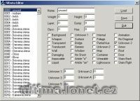

Program na editaci tiledata.mul.

Program edit file tiledata.mul.

## Screenshot

## Downloads

- [Download](/files/manawydan/tiledataeditor.rar) (97 KB)

---

*Archived from the [Manawydan UO tools archive](https://web.archive.org/web/2015/http://ultima.manawydan.cz/) (originally by RadstaR, 2004-2016).*
