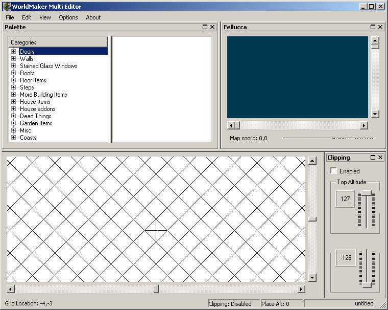
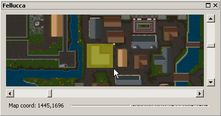
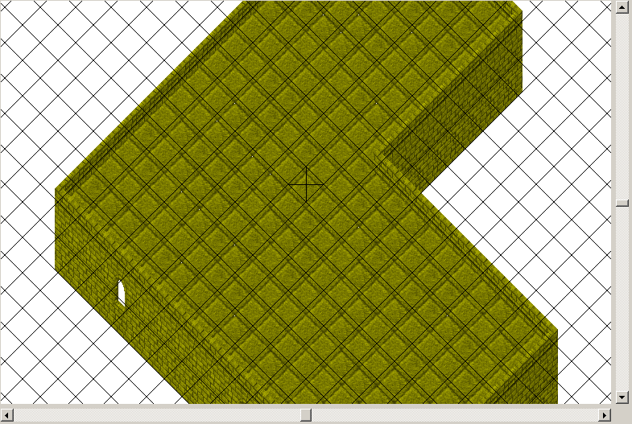
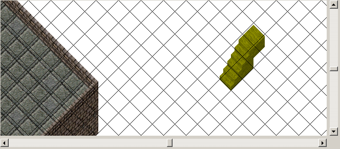
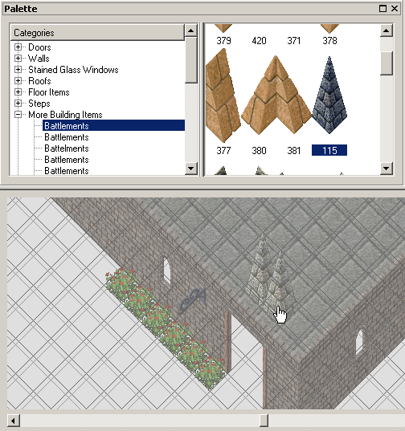
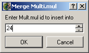
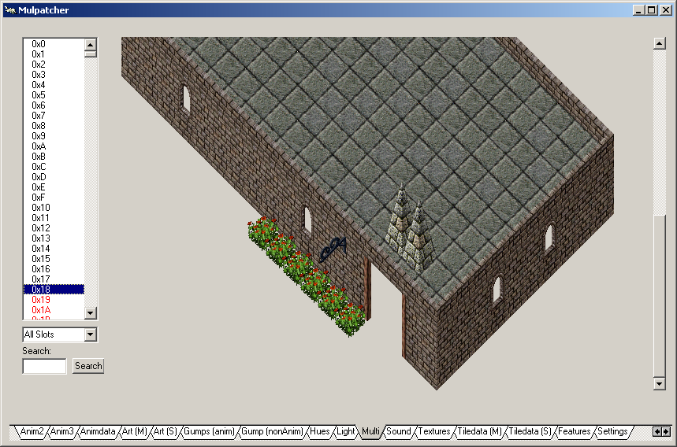
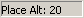

V tomto návodu si ukážeme, jak vzít nějaký objekt uložený ve statice a uložíme ho do MULTI.MUL.
K práci budeme potřebovat tyto programy: **WorldMaker Multi Editor** (2.35 MB), případně ještě **Mulpatcher** nebo **InsideUO** pro prohlížení obsahu souboru MULTI.MUL.

Po spuštění programu vyberte:
- **View/Clipping** - Umožní nastavit rozsah souřadnice Z, který se zobrazí.
- **View/Palette** - Itemy, které můžete přidat k vašemu objektu (seznam lze editovat v souboru palette.xml).
- **View/Radar/Fellucca** - Zobrazení mapy ze které budeme exportovat objekt, který pak uložíme do multi.mul.
- **Options/Grid/Enable** - Zapnutí pomocné mřížky

V okně s mapou (v našem případě Fellucca) si najděte objekt, který chcete uložit do multi.mul. Můžete použít posuvníky nebo rychlejší metodu, zadání souřadnic kliknutím pravým tlačítkem myši na mapě, vybráním **Goto**. Mapu si můžete i různě přibližovat kliknutím pravým tlačítkem myši na mapě a vybráním **Magnification** a velikosti zoomu.

Pokud máte objekt nalezen, vyberte ho pomocí levého tlačítka myši (podržte levé tlačítko a hýbejte myší dokud nebude celý objekt překrývat žlutá barva) a potom stiskněte pravé tlačítko myši a vyberte **Extract**.

Vyberte **Edit/Paste** a umístěte si vybraný objekt do okna s pomocnou mřížkou.

Prohlédněte si celý objekt a jeho okolí, zda nemáte kolem věci, které tam mít nechcete. Pokud na nějaké narazíte, klikněte na daný item pomocí levého tlačítka myši (označí se žlutě) a stiskněte klávesu **DELETE**. Vybrat můžete i několik itemů najednou přidržením klávesy CTRL a mačkáním levého tlačítka myši na itemech nebo podržením levého tlačítka myši a označením oblasti, kterou chcete vybrat.

Můžete využít i **Palette** a k objektu přidat další itemy. Vyberte si item, který chcete k objektu přidat a klikněte na něj 2x levým tlačítkem myši. Takto vybraný item umístěte k objektu. Vkládání přerušíte stiskem klávesy **ESC**. Pokud chcete umístit item do jiné výšky než 0, vyberte **Options/Placing/Altitude** a zadejte výšku do které chcete itemy vkládat. Nemusíte tuto výšku měnit pokaždé, když budete chtít dát item do jiné výšky. Pokud dáváte itemy do výšky 0 a chcete ho dát do výšky 5, označte si item a pomocí kláves **+** a **-** změníte jeho výšku. Můžete také použít šipky na klávesnici pro posouvání itemů.

Vybraný objekt nyní máme upraven, přesně tak, jak ho chceme do multi.mul dostat. Vyberte proto **File/Export/Multi.mul Entry** a zadejte číslo ID, pod kterým se má náš objekt uložit (číslo zadávejte v desítkové soustavě DEC).

Náš objekt je nyní uložen v souboru multi.mul.

**Tipy:**
- Do jaké výšky budete nový item přidávat se dozvíte na spodní liště programu: 
- Objekty můžete importovat jak z multi.mul, tak například z UO Architekta vybráním **Edit/Insert**
- Volnou pozici pro uložení vašeho objektu nejlépe najdete v programu MulPatcher.

---

*Archived from the [Manawydan UO tools archive](http://ultima.manawydan.cz/) (originally by RadstaR, 2004-2016).*
