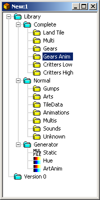
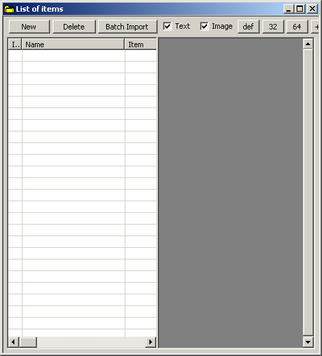
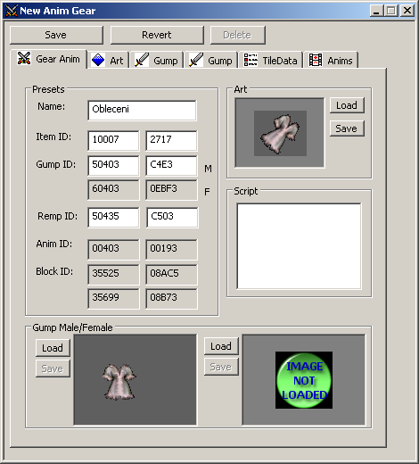
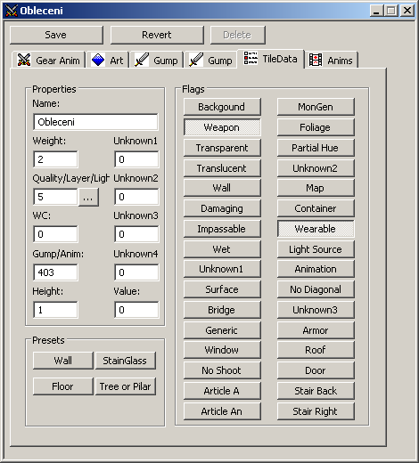
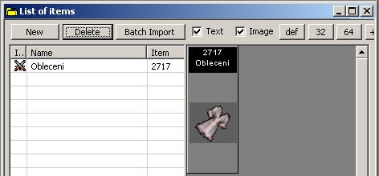
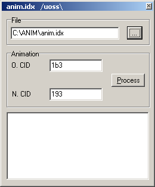

V tomto návodu vám ukážu jak jednoduše vytvořit nový předmět, kterému přiřadíme novou grafiku, ale starou animaci.
Ke práci budeme potřebovat program **MULBuilder**, případně ještě **Anim.IDX Patcher** a **InsideUO**.

Nejprve si připravte novou grafiku. Nebudu tu rozebírat jak mají být velké obrázky atd. Můžete to zjistit pomocí InsideUO a prohlídnutím si pár originálních obrázků.

Spusťte MULBuilder a jako první si nastavte cesty k souborům v FILE/CONFIGURATION

**Project Folder** - Nastavení adresáře celého projektu
**Compile Folder** - Adresář kam se vám uloží vygenerované upravené soubory
**Originals Folder** - Adresář ve kterém máte uloženy originální soubory UO
**Image Folder** - Adresář s obrázkama itemů

Pokud nastavíte vše správně, klikněte na FILE/NEW. Otevře se vám nové okno.

Nyní klikněte na GEARS ANIM, otevře se vám další okno.

Opět klikněte na NEW a v seznamu se vám vytvoří první položka s názvem NEW ANIM GEAR na kterou 2x klikněte. Zde už zadáváte parametry daného předmětu.

**Name** - Jméno itemu pro snadnější rozeznání pokud jich děláte víc najednou
**Item ID** - Číslo itemu pod kterým se má uložit obrázek, pokud je položen na zemi
**Gump ID** - Číslo itemu pod kterým se má uložit obrázek, pokud ho má postava v ruce nebo na sobě
**Remp ID** - Číslo gumpu animace itemu

Jak vidíte nic složitého, ale asi vás napadne, jaká správná čísla doplnit? To naštěstí není takový problém, ale chce to chvilku hledat. Do **ITEM ID** musíte zadat číslo, které není obsazené (tedy pokud nechcete nahradit starý item novým). Toto číslo můžete vyhledat pomocí programu **InsideUO** po kliknutí na **ARTWORKS**, kde se vám zobrazí všechny itemy, které vidíte pokud jsou položeny na zemi. Dole v okně pak vidíte u každého itemu číslo pod kterým je uložený (**MODEL NO**). Pokud se vám nechce volná čísla hledat můžete například použít **10002** až **10909**. Do **GUMP ID** musíte také zadat číslo které ještě není obsazeno (pokud opět nechcete nahradit existující item). Zde už je hledání podstatně horší. Gump totiž může obsahovat obrázek itemu jak pro mužské, tak ženské pohlaví. Obrázky pro mužské pohlaví naleznete v rozmezí **50000** až **51000** a obrázky pro ženské pohlaví v rozmezí **60000** až **61000**. Co to pro nás znamená? Pokud totiž přidáte třeba pod číslo 50403 nějaký obrázek, automaticky bude přiřazen i pod 60403 (ale ne naopak), proto při hledání volného čísla musíte dávat pozor zda jsou obě čísla opravdu bez obrázku. Pokud se vám opět nechce hledat volná čísla můžete zkusit následující: 50402, 50403, 50420, 50421, 50423-50429, 50432, 50433, 50451-50453 atd.

Nyní si tedy přiřadíme jednotlivé obrázky. V okně **ART** klikněte na **LOAD** a najděte si obrázek itemu, pokud leží na zemi. V okně **GUMP MALE/FEMALE** pomocí **LOAD** nahrajte obrázek (vlevo pro muže, vpravo pro ženu), který bude vidět na paperdollu postavy.

Asi se divíte proč mám nahraný obrázek ženského prádla v okně pro muže. Je to tím, jak už jsem psal, že obrázek určený pro muže se automaticky zobrazí i u ženy. Pokud však nechceme aby si mohl nasadit tento obleček i muž (aby to nevypadalo divně), ošetříme si toto ve scriptu. Prostě zakážeme nasazení oblečku mužskému pohlaví. Asi si řeknete, proč to dělám zrovna takhle. Bohužel pokud přiřadíte obrázek jen ženskému pohlaví, tento se zobrazí jen u něho, ale nepůjde z postavy sundat klasickým táhnutím myší do báglu.

Nakonec se dostáváme k **REMP ID**. Zde zadáte číslo animace přiřazenou k itemu (jedná se o animaci dané věci přímo na postavičce). Jelikož pro nový item nemáme vytvořeno novou animaci, použijeme nějakou z originálu — nejblíže podobnou najdeme pod číslem **50435**. Jak vidíte zadává se sem číslo gumpu a ne přímo číslo animace jako takové. Vše zase nalezneme pomocí programu **InsideUO**, tentokrát pod **GUMPS**. Tady ale pozor. Toto číslo má význam pouze tehdy, pokud budete pro svůj shard používat výhradně Ultimu Online: TD nebo AoS, které jednoduše ukládají toto nastavení do textového souboru (**body.def**). Pokud budete používat starší verze UO, nechte položku REMP ID prázdnou — na konci návodu si ukážeme jak přiřadit správnou animaci i do starší verze.

Jak vidíte v okně máme ještě záložky **ART**, **GUMP**, **GUMP**, **TILEDATA** a **ANIMS**. V ART, GUMP (pro muže), GUMP (pro ženu) se můžete podívat na přiřazený obrázek a můžete zkoumat, zda nám pasuje na postavě a zda neobsahuje nějaké chyby.

Nyní klikněte na **TILEDATA**.

**Name** - Jméno itemu, které se nám zobrazí ve hře, pokud mu nedáme jméno pomocí scriptu
**Weight** - Váha itemu
**Quality/Layer** - Vrstva ve které bude item uložen
**Gump/Anim** - Číslo animace (číslo gumpu). Toto číslo se doplní automaticky z GUMP ID
**Height** - Nevím k čemu přesně to slouží a všude zadávám 1

Bohužel význam dalších věcí neznám tak dobře a proto vysvětlím jen to co vím. V **QUALITY/LAYER** nastavte vrstvu. Klikněte vedle na **...** a vyberte ze seznamu co vlastně je váš item zač. Poté jen zadejte váhu itemu a nakonec to nejdůležitější — zadejte atributy itemu pomocí **FLAGS**. Názvy atributů mluví za vše a pokud si nejste jisti, co zadat, bohužel musíte hledat na internetu co který atribut znamená nebo se podívejte na atributy nějakého již hotového itemu pomocí programu **TileData Editor**.

Nyní již klikněte na tlačítko **SAVE** a máte svůj první vytvořený item.

Teď nám již nic nebrání vygenerovat upravené soubory. Klikněte tedy v hlavním okně na **ORIGINAL/IMPORT ALL ESSENCIAL** — chvilku počkejte. Nakonec vyberte **GENERATE/ALL** a na vybrané místo se vám uloží upravené soubory. Pokud jste itemu přiřadili i animaci a budete používat novější verzi UO, klikněte ještě na **GENERATE/REPLACEMENT ID**.

Tím máme prakticky hotovo. Všechny soubory kromě VERDATA.SCP a COPIEATENDOF_BODY.DEF překopírujte do adresáře s UO. Pokud však máte novější verzi UO, překopírujte obsah souboru **COPIEATENDOF_BODY.DEF** na konec souboru **BODY.DEF**, který se nalézá v adresáři s UO.

Pokud jste zadávali hodnoty stejné jako já v návodu, váš nový item naleznete pod číslem 2717 a nyní již zbývá vytvořit pro něj script.

BTW: číslo 2717 je HEX číslo čísla 10007. Pokud nevíte jak převádět číslo mezi DEC na HEX, použijte na to klasickou kalkulačku, která je součástí Windows, akorát ji přepněte na vědeckou (ZOBRAZIT/VĚDECKÁ).

A teď se vraťme k těm, kteří nemají novější verzi UO. Do adresáře kde máte rozbalený program **Animpatcher** přihrajte soubor **ANIM.IDX**, který se nalézá ve vašem adresáři s Ultimou Online. Nyní můžete Animpatcher spustit.

Klikněte vedle okna **FILE** na **>...** a otevřete si soubor **ANIM.IDX**, který jste překopírovali k programu. Nyní jen nastavíme do okna **O.CID** číslo originální animace (v našem případě **345**, který převedeme na hex číslo **1b3**) a do okna **N.CID** číslo naší animace (zjistíte ho třeba v **MULBuilder**u při vytváření itemu v Anim ID). V našem případě **193**. Nakonec stačí jen kliknout na **PROCESS** a vámi vybraný soubor program upraví a můžete ho překopírovat do adresáře s UO.

---

*Archived from the [Manawydan UO tools archive](http://ultima.manawydan.cz/) (originally by RadstaR, 2004-2016).*
